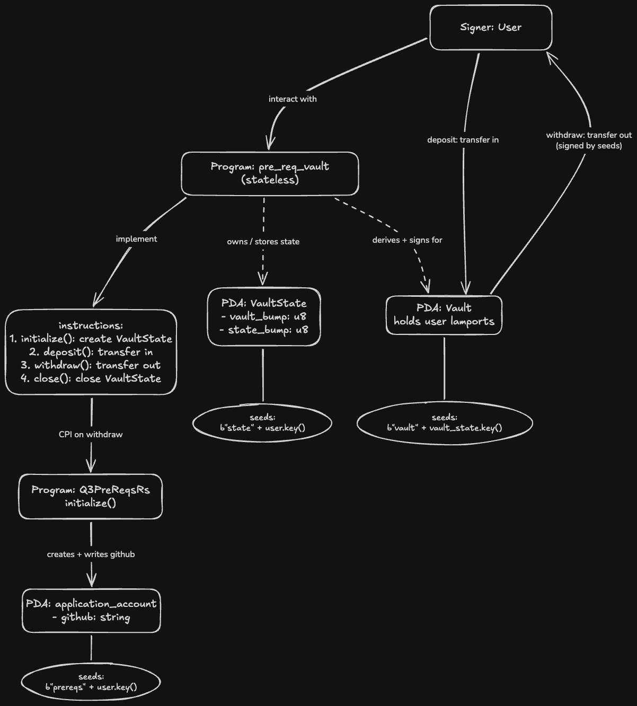

# Pre-Req Vault

An Anchor-based Solana Vault program where a user can deposit and withdraw lamports into a personal vault.

As part of the Turbin3 Q3 2026 Builders prerequisite challenge, the `withdraw` instruction has been extended to perform a Cross-Program Invocation (CPI) to the Turbin3 registration program (`Q3PreReqsRs`), which records the user's GitHub username on-chain after a successful withdrawal.

### Architecture



The instructions run in this order over the vault's lifetime:

1. `initialize` — creates the VaultState and stores the bumps.
2. `deposit` — moves lamports from the user's wallet into the Vault (the user signs).
3. `withdraw` — moves lamports from the Vault back to the user. Since the Vault is a PDA with no private key, the program signs on its behalf using the seeds. After the transfer, it performs a CPI to Q3PreReqsRs to register the GitHub username on-chain.
4. `close` — returns the rent, closes the VaultState, and empties the Vault.

### Walkthrough video

A short video walkthrough of the architecture and flow (with captions): [Watch on YouTube](https://youtu.be/6ah7L5QnPZw)

### Build & test

Tests run against devnet, where the `Q3PreReqsRs` registration program is deployed.

```bash
anchor keys sync
anchor test
```